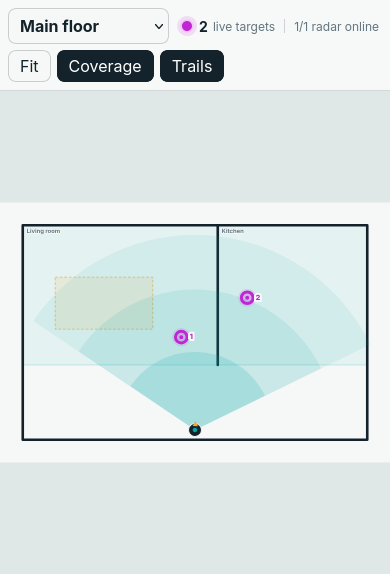

# Spatial Presence

[](https://github.com/daredoole/spatial-presence/actions/workflows/ci.yml)
[](https://www.hacs.xyz/docs/faq/custom_repositories/)
[](https://www.home-assistant.io/)
[](LICENSE)

A local-first Home Assistant floorplan editor and live whole-home mmWave map.
Place radars where they actually live, calibrate them against a known point,
and see anonymous detections move through rooms and zones.

[](https://my.home-assistant.io/redirect/hacs_repository/?owner=daredoole&repository=spatial-presence&category=integration)


> Alpha software. Map editing, persistent storage, ESPHome LD2450 discovery,
> native occupancy entities, and HACS packaging work today. Cross-radar target
> fusion is still on the roadmap.

## What it does

- Fits even tall floorplans inside a compact, fixed-height viewport—no giant
  page or floorplan scrolling.
- Draws every live target as a moving person with an optional trail directly
  over the selected floor; stationary detections remain visually still.
- Supports multiple floors and multiple radars without changing cards.
- Draws rooms, walls, detection zones, exclusions, entrances, and stationary
  zones in the visual editor.
- Creates native occupancy, target-count, and enter/leave entities for named
  rooms and zones.
- Auto-discovers ESPHome LD2450 coordinate families and handles metric or
  Home Assistant-converted imperial units.
- Keeps floorplans, maps, and short-lived target trails local to Home Assistant
  and the browser.

## Quick start

1. Use **Open in HACS** above, or add
   `https://github.com/daredoole/spatial-presence` as a custom **Integration**.
2. Install **Spatial Presence**, restart Home Assistant, then add it from
   **Settings → Devices & services → Add integration**.
3. Add the **Spatial Presence** card to a dashboard.
4. Open the visual editor, add a floorplan, place your radar, and choose
   **Calibrate placement**.
5. Draw rooms or zones, then choose **Save map**.

See the illustrated [getting-started guide](docs/GETTING_STARTED.md) for the
full setup, manual installation, LD2450 entity requirements, and troubleshooting.

## Recommended hardware

**Affiliate disclosure:** As an Amazon Associate, I may earn from
qualifying purchases made through these links, at no additional cost to you.

- [LD2450 24 GHz multi-target tracking radar module](https://amzn.to/4xE6x72)
- [ESP32-S3 N16R8 USB-C development board](https://amzn.to/46EtZoP)

The current reference wiring and ESPHome configuration are verified on an
ESP-WROOM-32. The linked ESP32-S3 is a capable alternative, but it needs an
ESP32-S3 board definition and S3-safe GPIO choices; do not copy the WROOM-32
AHT20 GPIO22 mapping because ESP32-S3 chips do not expose GPIO22.

## Interface

The map opens fitted to the available card area. Pan or zoom inside the map;
the dashboard page stays put. The header always reports live target and online
radar counts, while magenta person markers, speed-aware walking motion, trails,
and teal coverage bands remain visible over imported floorplans. Motion is
disabled automatically when the browser requests reduced motion.



## Ecosystem fit

[Easy Floorplan](https://github.com/nicosandller/easy-floorplan) is a strong
visual floorplan editor. [Radar Map Manager](https://github.com/Moe8383/radar_map_manager)
is a strong radar placement and fusion tool. Spatial Presence focuses on the
gap between them and ships explicit import/export adapters instead of copying
either project. See [interoperability](docs/INTEROPERABILITY.md) and the
[schema RFC](docs/RFC-0001-SPATIAL-MAP.md).

## Development

Requirements: Node.js 20+ and Python 3.12+.

```bash
npm ci
npm run typecheck
npm test
npm run build
python -m unittest discover -s tests/python -v
```

Read [CONTRIBUTING.md](CONTRIBUTING.md) before changing the schema or an
adapter. Security issues belong in GitHub private vulnerability reporting, not
public issues; see [SECURITY.md](SECURITY.md).

## Support the project

Spatial Presence is free and MIT-licensed. If it saves you time, you can
[buy Me a coffee](https://buymeacoffee.com/daredoole). Sponsorship never
buys feature priority, private support, or access to unreleased security fixes.

For help and project boundaries, see [SUPPORT.md](SUPPORT.md).
