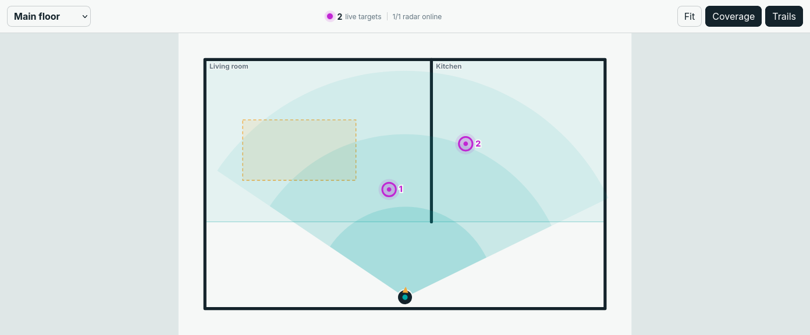

# Getting started

Spatial Presence needs Home Assistant 2026.6 or newer and at least one radar
that publishes local target coordinates. The built-in adapter recognizes the
common ESPHome LD2450 entity family:

```text
sensor.<prefix>_target_1_x
sensor.<prefix>_target_1_y
binary_sensor.<prefix>_status
```

Targets 2–9 are picked up when present. Millimetres, centimetres, metres,
inches, and feet are normalized automatically.

## Recommended hardware

**Affiliate disclosure:** As an Amazon Associate, Darrian may earn from
qualifying purchases made through these links, at no additional cost to you.

- [LD2450 24 GHz multi-target tracking radar module](https://amzn.to/4xE6x72)
- [ESP32-S3 N16R8 USB-C development board](https://amzn.to/46EtZoP)

The tested reference build uses an ESP-WROOM-32. The linked ESP32-S3 requires
an ESP32-S3 ESPHome board definition and different AHT20 pins; GPIO22 from the
WROOM-32 wiring guide is not available on ESP32-S3 chips.

## Install with HACS

[](https://my.home-assistant.io/redirect/hacs_repository/?owner=daredoole&repository=spatial-presence&category=integration)

The button opens the repository in your own Home Assistant instance. If your
browser has not been connected to that instance yet, the My Home Assistant
page asks for its address first.

1. Use **Open in HACS** above, or open **HACS → Integrations**.
2. Open the three-dot menu and choose **Custom repositories**.
3. Add `https://github.com/daredoole/spatial-presence` with category
   **Integration**.
4. Search for **Spatial Presence** and install the newest release.
5. Restart Home Assistant.
6. Open **Settings → Devices & services → Add integration**, search for
   **Spatial Presence**, and finish the one-step setup.

The integration registers the dashboard card automatically. Refresh the
browser once after installation if it is not immediately available.

## Add the first map

1. Edit a dashboard and add the **Spatial Presence** card.
2. Open its visual editor and add a floor.
3. Optional: copy a PNG, WebP, or SVG plan to
   `/config/www/floorplans/`, then use a URL such as
   `/local/floorplans/main-floor.svg`.
4. Enter the plan dimensions and an initial pixels-per-metre estimate.
5. Select the discovered radar, drag it to its physical wall location, and
   rotate it toward the room.
6. Choose **Calibrate placement**. Have one person stand at a recognizable
   point, select their live target, and click that point on the plan.
7. Draw room and zone polygons. Give each useful area a stable ID and name.
8. Choose **Save map**.

The card always starts fitted to the floor. Pan and wheel/pinch zoom operate
inside the compact map viewport, so a tall scan never makes the dashboard page
itself enormous.



## Native Home Assistant entities

Every named room and every non-exclusion zone gets:

- an occupancy binary sensor;
- an instantaneous target-count sensor; and
- an enter/leave event entity.

Exclusion zones suppress false detections. Stationary zones can hold occupancy
after a target vanishes while their raw target count immediately returns to
zero. Entity IDs are derived from stable map, floor, and feature IDs, so
renaming a room does not replace its entities.

## Manual preview installation

```bash
npm ci
npm run build
```

Copy `custom_components/spatial_presence` to Home Assistant
`/config/custom_components/`, run a configuration check, restart Home
Assistant, and add the integration from **Devices & services**.

## Troubleshooting

- **No compatible radar found:** confirm the `target_1_x` and `target_1_y`
  entities exist and share the same prefix.
- **Radar unavailable:** check the ESPHome device and its status binary sensor.
- **Target appears in the wrong place:** repeat calibration with one stationary
  person and verify the floor scale.
- **Card missing after installation:** hard-refresh the browser and confirm the
  integration loaded successfully.
- **No occupancy entities:** save at least one named room or non-exclusion zone,
  then reload the Spatial Presence integration.

Never include access tokens, private URLs, or real-home floorplans in a public
bug report. Use a minimized example map instead.
